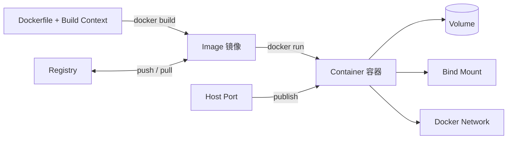

# Docker 基础与常用语法

## 核心问题

如何理解 Docker 的核心对象，并使用常用 CLI、Dockerfile 和 Compose 完成基础容器开发与排障？

## 简要结论

Docker 用镜像描述只读应用模板，用容器表示镜像的运行实例；容器的可写层随容器删除而消失，持久数据应放入 volume 或明确的 bind mount。Dockerfile 用于构建镜像，Compose 文件用于声明如何运行一个或多个服务，二者职责不同。

## 1. 核心对象



| 对象 | 含义 | 生命周期 |
|---|---|---|
| Image | 分层、只读的应用模板 | 可被多个容器复用 |
| Container | 镜像的一个运行实例，加一层临时可写层 | 删除容器时可写层随之删除 |
| Registry | 存储和分发镜像的服务，如 Docker Hub 或私有仓库 | 独立于本地主机 |
| Volume | 由 Docker 管理的持久数据 | 可独立于容器存在 |
| Bind mount | 把宿主机指定路径挂进容器 | 直接依赖宿主路径与权限 |
| Network | 容器间通信和服务发现的网络范围 | 可由 CLI 或 Compose 管理 |

Docker 在 Linux 上最终依赖 namespace、cgroup 和 OCI runtime 等机制。容器共享宿主机内核，不等于虚拟机，也不应被当成天然的强安全边界。更底层原理见[底层隔离与 OCI/Docker](../../agent/concepts/infrastructure/01-sandbox-oci-docker.md)。

## 2. 镜像常用命令

```bash
# 查看本地镜像
docker image ls

# 拉取镜像；生产环境应使用明确版本或 digest
docker pull nginx:1.27

# 查看镜像详细信息
docker image inspect nginx:1.27

# 查看镜像分层历史
docker image history nginx:1.27

# 删除本地镜像
docker image rm nginx:1.27
```

不要依赖含义会变化的 `latest` 标签作为生产部署版本。标签是可移动名称，digest 才是内容寻址标识。

## 3. 启动和管理容器

```bash
# 前台运行，退出后自动删除
docker run --rm hello-world

# 后台运行 nginx，命名并发布端口
docker run -d \
  --name web \
  -p 8080:80 \
  nginx:1.27

# 查看运行中容器；-a 包含已停止容器
docker ps
docker ps -a

# 查看日志并持续跟踪
docker logs -f --tail 100 web

# 在运行中容器执行命令
docker exec -it web sh

# 查看底层配置和状态
docker inspect web
docker stats web

# 停止、启动、重启
docker stop web
docker start web
docker restart web

# 删除已停止容器
docker rm web
```

`-p 8080:80` 表示把宿主机端口 `8080` 发布到容器端口 `80`，顺序是 `host:container`。默认可能监听宿主机所有网卡；只需本机访问时显式绑定回环地址：

```bash
docker run -d --name web -p 127.0.0.1:8080:80 nginx:1.27
```

`docker exec` 是在已有容器中启动新进程，不是“进入一个虚拟机”。精简镜像可能没有 Bash，应尝试 `sh`。

## 4. 环境变量与资源限制

```bash
docker run --rm \
  --name app \
  -e APP_ENV=development \
  --env-file .env \
  --cpus 1.5 \
  --memory 512m \
  my-app:dev
```

- `-e` 或 `--env-file` 提供运行时配置，但环境变量不是安全的秘密存储。
- 不要把 `.env` 提交仓库或复制进镜像。
- CPU、内存和 PID 等限制能减少单个容器耗尽宿主资源的风险。

## 5. 持久化：Volume 与 Bind Mount

### Named volume

```bash
docker volume create app-data

docker run -d \
  --name db \
  --mount type=volume,src=app-data,dst=/var/lib/postgresql/data \
  postgres:17

docker volume ls
docker volume inspect app-data
```

适合数据库等由容器管理内容、无需直接对应宿主项目路径的数据。

### Bind mount

```bash
docker run --rm \
  --mount type=bind,src="$PWD",dst=/workspace,readonly \
  alpine:3.21 \
  ls -la /workspace
```

适合把源码或明确宿主配置挂入容器。Bind mount 直接暴露宿主路径，写权限可能让容器修改或删除宿主文件；只读场景加 `readonly`。

推荐 `--mount`，因为参数含义更明确。删除容器不会自动删除 named volume；删除 volume 是数据操作，应先确认备份和引用关系。

## 6. 网络基础

```bash
# 创建用户定义网络
docker network create app-net

# 两个容器加入同一网络，可通过容器名解析
docker run -d --name redis --network app-net redis:7
docker run --rm --network app-net redis:7 redis-cli -h redis ping

docker network ls
docker network inspect app-net
```

容器间通信使用容器端口；`ports`/`-p` 是把端口暴露给宿主或外部访问。不要为了容器互联而无必要地发布数据库端口。

## 7. 使用 Dockerfile 构建镜像

最小示例：

```dockerfile
FROM node:22-alpine

WORKDIR /app

COPY package.json package-lock.json ./
RUN npm ci --omit=dev

COPY . .

USER node
EXPOSE 3000
CMD ["node", "server.js"]
```

构建与运行：

```bash
docker build -t my-app:dev .
docker run --rm -p 127.0.0.1:3000:3000 my-app:dev
```

最后的 `.` 是 build context。Dockerfile 的 `COPY` 只能读取 context 内的文件，因此应使用 `.dockerignore` 排除不需要或敏感的内容：

```dockerignore
.git
.env
node_modules
dist
*.log
```

常见指令：

| 指令 | 用途 | 注意事项 |
|---|---|---|
| `FROM` | 指定基础镜像 | 尽量使用明确版本或 digest |
| `WORKDIR` | 设置后续指令工作目录 | 比多次 `RUN cd ...` 清晰 |
| `COPY` | 从 build context 复制文件 | 先复制依赖清单可提高缓存利用率 |
| `RUN` | 构建阶段执行命令并形成层 | 合理合并并清理包管理缓存 |
| `ENV` | 设置镜像内环境变量 | 不放密钥；会进入镜像元数据/层 |
| `USER` | 设置运行用户 | 能不用 root 就不用 root |
| `EXPOSE` | 记录容器预期监听端口 | 不会自动发布宿主端口 |
| `ENTRYPOINT` | 定义固定入口程序 | 常与 `CMD` 的默认参数配合 |
| `CMD` | 提供默认命令或参数 | 推荐 JSON exec form |

`RUN` 发生在构建镜像阶段，`CMD`/`ENTRYPOINT` 在容器启动时生效，这是最常见的概念混淆之一。

## 8. Docker Compose 入门

Dockerfile 描述“如何构建一个镜像”；`compose.yaml` 描述“如何运行一组服务”。

```yaml
services:
  web:
    build: .
    ports:
      - "127.0.0.1:8080:3000"
    environment:
      REDIS_HOST: redis
    depends_on:
      - redis

  redis:
    image: redis:7-alpine
    volumes:
      - redis-data:/data

volumes:
  redis-data:
```

常用命令：

```bash
# 后台启动，并在需要时构建镜像
docker compose up -d --build

# 查看服务
docker compose ps

# 跟踪日志
docker compose logs -f --tail 100

# 在服务容器内执行命令
docker compose exec web sh

# 停止并删除 Compose 创建的容器和网络
docker compose down

# 同时删除 named volumes：会永久删除持久数据，谨慎使用
docker compose down -v
```

Compose 是声明式工具：修改文件后再次执行 `docker compose up`，它会协调实际状态。`depends_on` 主要表达启动依赖，不代表应用已经健康可用；需要可靠就绪判断时配置 `healthcheck` 并让应用自身具备重试能力。

## 9. 常用排障路径

遇到“容器不能用”时按层检查：

1. `docker ps -a`：容器是否已退出，退出码是什么。
2. `docker logs <container>`：主进程为何退出或报错。
3. `docker inspect <container>`：命令、环境、挂载、网络和健康状态是否符合预期。
4. `docker exec`：进程仍运行时，在容器内检查文件和监听端口。
5. 检查 `host:container` 端口方向、防火墙与应用监听地址。
6. 检查 volume/bind mount 是否遮蔽镜像内原有目录，以及 UID/GID 权限。
7. 构建异常时检查 build context、`.dockerignore` 和缓存；必要时再使用 `--no-cache`。

## 10. 安全与清理

- 只使用可信镜像，固定版本，定期更新基础镜像并扫描漏洞。
- 不把密钥放入 Dockerfile、`ENV`、构建参数或镜像层。
- 默认使用非 root 用户，减少 capabilities，避免随意使用 `--privileged`。
- Docker daemon 权限接近宿主 root 权限；不要把 Docker socket 随意挂入容器。
- 发布端口时优先绑定所需网卡；数据库等内部服务只放在容器网络。
- 清理前先列出对象并确认范围：`docker system prune` 可能删除大量未使用资源，不作为日常第一选择。
- `docker compose down -v` 会删除持久卷，执行前确认数据可恢复。

## 适用边界

- 本文覆盖单机 Docker 基础，不涵盖 Swarm、Kubernetes、BuildKit 高级缓存和生产集群运维。
- Docker Desktop 与原生 Linux Docker Engine 在网络、文件共享和虚拟机边界上存在差异。
- 容器安全隔离强度取决于内核、runtime、权限和配置；高风险多租户场景需评估 VM/Kata 等更强边界。

## 相关知识

- [底层隔离与 OCI/Docker](../../agent/concepts/infrastructure/01-sandbox-oci-docker.md)
- [SSH 公钥免密登录](ssh-key-auth.md)

## 参考资料

- [Docker Get Started](https://docs.docker.com/get-started/)
- [Docker CLI Reference](https://docs.docker.com/reference/cli/docker/)
- [Dockerfile Reference](https://docs.docker.com/reference/dockerfile/)
- [Docker Compose Quickstart](https://docs.docker.com/compose/gettingstarted/)
- [Docker CLI Cheat Sheet](https://docs.docker.com/get-started/docker_cheatsheet.pdf)

