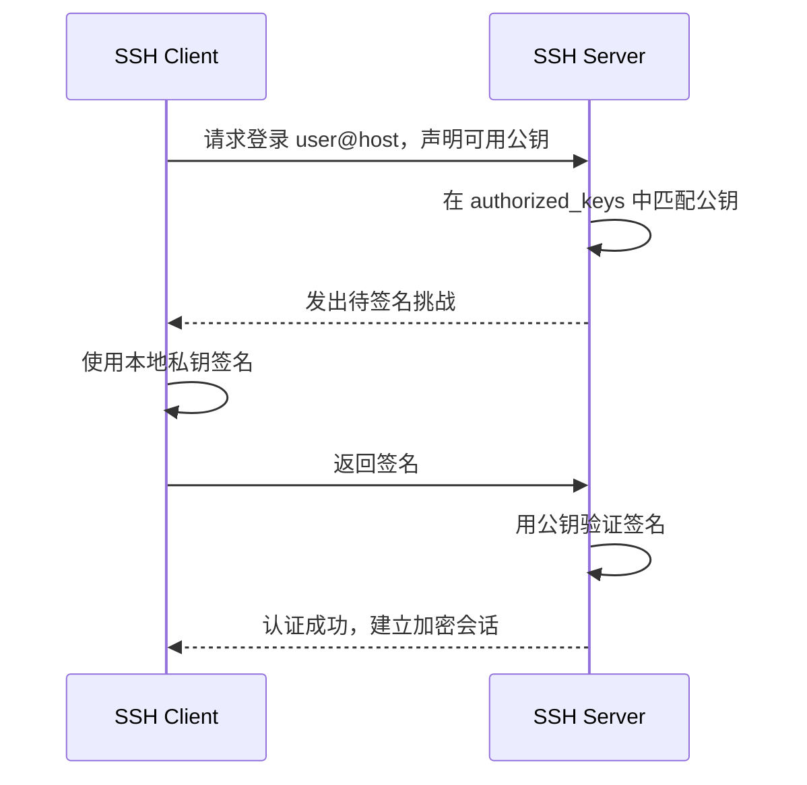

# SSH 公钥免密登录

## 核心问题

如何正确配置 SSH 公钥认证，实现无需输入远端账户密码的登录，同时保留私钥保护和可排障性？

## 一句话解释

SSH 公钥认证是客户端用本地私钥签名证明身份、服务器用预先登记的公钥验证，从而无需传输或输入远端账户密码的登录方式。

## 详细解释

私钥始终留在客户端，服务器在目标用户的 `authorized_keys` 中查找对应公钥；推荐使用 Ed25519 密钥并设置 passphrase，再由 `ssh-agent` 缓存解锁结果，而不是生成完全无保护的私钥。



## 1. 前置条件

- 已知服务器地址、SSH 端口和远端用户名。
- 服务器运行 SSH 服务，网络与防火墙允许连接。
- 初次配置时能通过密码、控制台或管理员渠道写入目标用户的 `authorized_keys`。
- 本地安装 OpenSSH Client。

先验证普通连接：

```bash
ssh -p 22 user@server.example.com
```

第一次连接会显示主机指纹。应通过可信渠道核对指纹，而不是不加检查地输入 `yes`。接受后，主机公钥记录在本地 `~/.ssh/known_hosts`，它用于验证服务器身份，与用户登录公钥不是同一组密钥。

## 2. 生成专用密钥

先检查已有密钥，避免覆盖：

```bash
ls -la ~/.ssh
```

生成 Ed25519 密钥对，并用有含义的文件名区分用途：

```bash
ssh-keygen -t ed25519 -a 100 -C "user@client-purpose" -f ~/.ssh/id_ed25519_dev_server
```

产生两个文件：

- `~/.ssh/id_ed25519_dev_server`：**私钥**，不得上传、复制给服务器或提交 Git。
- `~/.ssh/id_ed25519_dev_server.pub`：公钥，可以安装到服务器。

生成时建议设置 passphrase。`-a 100` 增加私钥口令派生轮数，让被盗私钥更难被离线暴力破解，但也会略微增加解锁耗时。

老旧系统不支持 Ed25519 时可使用 RSA 4096：

```bash
ssh-keygen -t rsa -b 4096 -C "user@client-purpose" -f ~/.ssh/id_rsa_dev_server
```

不要使用已淘汰的 DSA 密钥。

## 3. 把公钥安装到服务器

### 方式 A：使用 `ssh-copy-id`

Linux 等提供该命令的环境中：

```bash
ssh-copy-id -i ~/.ssh/id_ed25519_dev_server.pub -p 22 user@server.example.com
```

它会通过当前可用认证方式登录服务器，并把公钥追加到目标用户的 `~/.ssh/authorized_keys`。

### 方式 B：手动安装

先在本地显示公钥：

```bash
ssh-keygen -y -f ~/.ssh/id_ed25519_dev_server
# 或查看 .pub 文件
cat ~/.ssh/id_ed25519_dev_server.pub
```

在服务器目标用户下创建目录和文件，并将**完整的一行公钥**追加进去：

```bash
mkdir -p ~/.ssh
chmod 700 ~/.ssh
touch ~/.ssh/authorized_keys
chmod 600 ~/.ssh/authorized_keys
```

不要用覆盖写入破坏其他已授权公钥。若由管理员代配，还要确认文件属于目标用户：

```bash
chown -R user:user /home/user/.ssh
```

macOS 远端用户的主目录和用户组可能不同，应按系统实际路径与组名执行。

## 4. 测试指定私钥登录

```bash
ssh -i ~/.ssh/id_ed25519_dev_server -o IdentitiesOnly=yes -p 22 user@server.example.com
```

`IdentitiesOnly=yes` 要求客户端只使用明确指定的身份，避免 agent 中密钥过多导致服务器在试到正确密钥前就拒绝认证。

如果私钥设置了 passphrase，此时输入的是**本地私钥口令**，不是服务器账户密码。

## 5. 配置客户端别名

编辑本地 `~/.ssh/config`：

```sshconfig
Host dev-server
    HostName server.example.com
    User user
    Port 22
    IdentityFile ~/.ssh/id_ed25519_dev_server
    IdentitiesOnly yes
    ServerAliveInterval 60
```

设置权限并测试：

```bash
chmod 600 ~/.ssh/config
ssh dev-server
```

Git 远端也可以复用别名：

```bash
git remote set-url origin git@dev-server:group/repository.git
```

这里 `git` 是 SSH 用户名，实际 Git 仓库授权通常由平台根据公钥映射到平台账户。

## 6. 使用 ssh-agent 管理口令

启动或确认 agent 后加入密钥：

```bash
eval "$(ssh-agent -s)"
ssh-add ~/.ssh/id_ed25519_dev_server
ssh-add -l
```

agent 保存的是解锁后的签名能力，使当前会话无需重复输入 passphrase。不同操作系统的自动启动与钥匙串集成不同，应使用系统提供的方式，不要把 passphrase 写进脚本。

## 7. 服务端配置要点

服务端 `/etc/ssh/sshd_config` 或包含的配置片段通常需要允许：

```text
PubkeyAuthentication yes
AuthorizedKeysFile .ssh/authorized_keys
```

修改前先备份，并在保留一个已登录会话的情况下检查配置：

```bash
sudo sshd -t
```

然后按系统服务管理方式 reload，而不是直接断开当前连接。确认公钥登录成功后，才考虑关闭密码认证：

```text
PasswordAuthentication no
PermitRootLogin no
```

这是可能导致远程锁死的高风险操作；必须先验证至少一个普通管理用户可用公钥登录，并保留控制台或其他恢复渠道。

## 8. 排障

使用详细日志：

```bash
ssh -vvv dev-server
```

常见问题：

| 现象 | 检查项 |
|---|---|
| 仍要求账户密码 | 是否使用了正确用户、主机、端口和私钥；服务端是否启用公钥认证 |
| `Permission denied (publickey)` | 公钥是否完整写入目标用户的 `authorized_keys`；用户名是否正确 |
| `UNPROTECTED PRIVATE KEY FILE` | 私钥权限过宽；执行 `chmod 600 <private-key>` |
| 服务端忽略公钥 | `~/.ssh`、`authorized_keys` 所有权或权限错误；查看 sshd 日志 |
| 尝试太多密钥 | 设置 `IdentityFile` 和 `IdentitiesOnly yes` |
| 主机密钥变化警告 | 先确认服务器是否重装或遭遇中间人攻击，不要直接删除记录绕过检查 |

查看客户端最终解析配置：

```bash
ssh -G dev-server | less
```

服务端日志位置因系统而异，常见为 systemd journal、`/var/log/auth.log` 或 `/var/log/secure`。

## 9. 安全基线

- 每台客户端、每个用途使用独立密钥，方便单独撤销。
- 私钥不离开客户端，不进入镜像、仓库、聊天或工单。
- 推荐私钥 passphrase + `ssh-agent`，不要把“免密”理解成“无保护”。
- 定期清理 `authorized_keys` 中离职人员、旧设备和临时密钥。
- 可在 `authorized_keys` 公钥前增加来源地址、禁止转发或限定命令等约束，但应先理解业务需求。
- 服务器优先使用普通用户登录，再通过最小化的 `sudo` 提权；避免 root 直登。
- Host key 与 user key 职责不同：前者证明服务器身份，后者证明客户端用户身份。

## 适用边界

- 本文针对 OpenSSH 的普通服务器登录，不覆盖 SSH 证书机构、硬件安全密钥、堡垒机和企业集中身份系统。
- Windows、macOS 和 Linux 的 agent、服务管理、权限模型略有差异。
- 生产环境修改 sshd 配置前，必须遵循变更和回滚流程。

## 相关知识

- [Git 基础与常用命令](git-basics.md)
- [SSH Channel 接入](../../agent/integration/ssh-channel.md)

## 参考资料

- [OpenSSH `ssh` Manual](https://man.openbsd.org/ssh)
- [OpenSSH `ssh-keygen` Manual](https://man.openbsd.org/ssh-keygen)
- [OpenSSH Client Configuration](https://man.openbsd.org/ssh_config)
- [OpenSSH Server Configuration](https://man.openbsd.org/sshd_config)
- [GitHub: Generate and add an SSH key](https://docs.github.com/en/authentication/connecting-to-github-with-ssh/generating-a-new-ssh-key-and-adding-it-to-the-ssh-agent)
