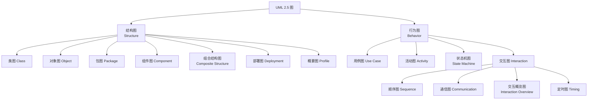

# UML：统一建模语言

## 核心问题

UML 是什么，它由哪些图组成，以及它解决什么问题、不解决什么问题？

## 一句话解释

UML（Unified Modeling Language，统一建模语言）是 OMG 维护的一套标准化的软件系统可视化建模语言，用统一的图形符号描述系统的结构与行为，作为团队和工具之间共享的设计表达方式。

## 详细解释

UML 是一套**语言**，不是一个开发流程或方法论。它只规定“如何用图形和文字表达一个模型”，不规定“先做什么图、谁在什么时候画、用什么节奏迭代”——后者属于 RUP、敏捷等过程框架。

它解决的核心问题是：让不同人（开发者、评审者、架构师、工具）对同一份设计有共同的符号约定，避免每人自造方框和箭头的含义。它是设计沟通与文档化的载体，而不是代码本身。

UML 的规范由 OMG（Object Management Group）发布，ISO 也将其采纳为标准（ISO/IEC 19505）。当前主流正式版本为 **UML 2.5.1**（OMG 于 2017 年发布）。

## 图分类

UML 2.5 共定义 14 种图，按“描述结构”还是“描述行为”分为两大类。



| 分类 | 图 | 典型用途 |
| --- | --- | --- |
| 结构 | 类图 | 类、属性、操作及继承、关联、依赖等静态关系 |
| 结构 | 对象图 | 某一时刻的对象实例及其链接快照 |
| 结构 | 包图 | 命名空间与包之间的组织、依赖 |
| 结构 | 组件图 | 可替换的组件及其接口、依赖 |
| 结构 | 组合结构图 | 类或组件的内部部件与端口连线的内部结构 |
| 结构 | 部署图 | 制品到节点（物理/虚拟运行环境）的部署拓扑 |
| 结构 | 概要图 | 定义 stereotype、tagged value 等 UML 扩展（Profile） |
| 行为 | 用例图 | 外部参与者与系统提供的用例之间的边界与关系 |
| 行为 | 活动图 | 业务流程或算法的控制流、数据流、并发与分叉 |
| 行为 | 状态机图 | 对象在生命周期中的状态、事件、迁移与守卫条件 |
| 行为 | 顺序图 | 按时间顺序展开的对象间消息交互 |
| 行为 | 通信图 | 以对象链接为中心组织的消息交互 |
| 行为 | 交互概览图 | 用活动图的方式串接多个交互片段 |
| 行为 | 定时图 | 关注时间约束与状态变化的时间轴视图 |

日常工程中，类图、顺序图、活动图、状态机图和部署图使用频率最高；其余图按需使用。

## 工作原理

理解 UML 需要区分「模型 / 图 / 规范」三个层次：

- **模型（Model）**：对系统的一整套语义描述，一个模型可以包含多张图。
- **图（Diagram）**：模型的一个视图，只是模型的局部投影，因此单张图不完整很正常。
- **规范（Specification）**：模型元素背后精确的语义、约束与关系定义，图只是它的可视化呈现。

UML 采用 MOF（Meta-Object Facility）四层元建模架构：

```text
M3  元元模型      MOF / UML 元模型自身的定义语言
M2  元模型        UML 元模型：Class、Association、State 等概念
M1  模型          你的系统模型：Order、Customer 等具体类
M0  实例           运行时真正存在的对象与链接
```

这套分层带来两个关键能力：一是**工具可交换**，模型可用 XMI（XML Metadata Interchange）序列化，在不同建模工具间导入导出；二是**可扩展**，通过 Profile 机制（stereotype、tagged value、约束）在标准 UML 上做领域特化，例如 SysML 就是基于 UML Profile 的系统工程建模语言。

## 适用边界

- UML 是**建模语言**，不是开发方法，也不强制任何迭代节奏或文档产出。
- UML 描述的是**设计与结构语义**，通常不直接执行；可执行 UML（xUML/fUML）属于特定工具或方法，不是标准本身。
- **不是所有设计都需要 UML**。绘制成本高，收益来自沟通，若读者只有自己、或代码已足够自解释，强行建模反而增加负担。
- **图不等于模型全集**，不能仅凭一张类图推断系统全貌；跨图一致性需要工具或人工校验。
- 版本敏感：1.x 与 2.x 在图的种类和符号上差异显著（如 1.x 的协作图在 2.x 更名为通信图，2.x 新增组合结构图等），引用时需说明版本。
- UML 2.5.1 是当前正式规范版本；OMG 后续工作（如 UML 2.6 的演化）需以 OMG 官方发布为准。
- 与 Mermaid、PlantUML 的关系：后者是**文本驱动的绘图工具**，语法借鉴 UML 概念但并非完整实现 UML 语义，适合轻量文档，不适合需要严格元模型一致性的场景。

## 实践意义

- 先确定地图目的：澄清结构用类图/组件图，说明时序用顺序图，描述流程或状态用活动图/状态机图，避免“为了画而画”。
- 区分「模型」与「图」，在文档中说明图是节选还是完整视图，减少误读。
- 需要领域专用符号时用 Profile 扩展，而不是自行发明与标准冲突的符号。
- 在纯文本协作场景（如本仓库）优先用 Mermaid 表达轻量结构，只有当语义精度和多工具互操作成为真实需求时才引入完整的 UML 建模工具链。

## 相关知识

- [工程工具基础](README.md)
- [Git 基础与常用命令](git-basics.md)

## 参考资料

- [OMG Unified Modeling Language (UML) 规范主页](https://www.omg.org/spec/UML/)
- [OMG UML 2.5.1 规范（PDF）](https://www.omg.org/spec/UML/2.5.1/PDF)
- [OMG UML 2.5.1 规范（HTML）](https://www.omg.org/spec/UML/2.5.1/About-UML)
- [OMG 规范列表：UML 各版本下载入口](https://www.omg.org/spec/UML/2.5.1/)
